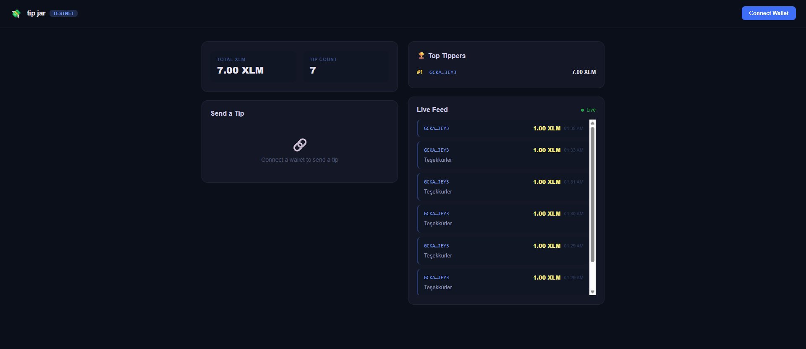
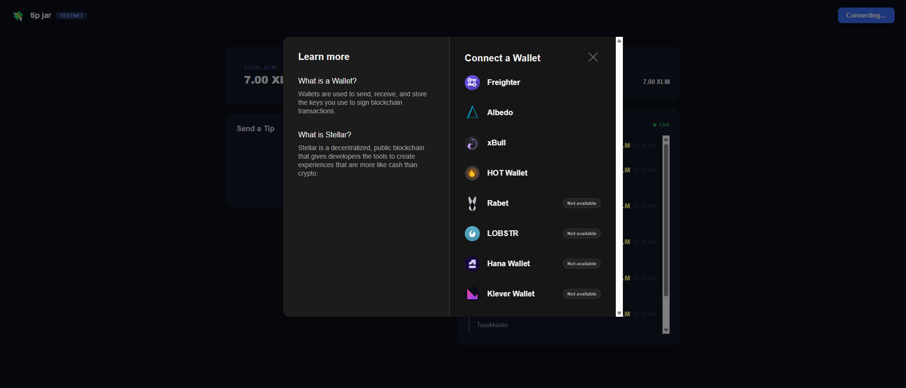
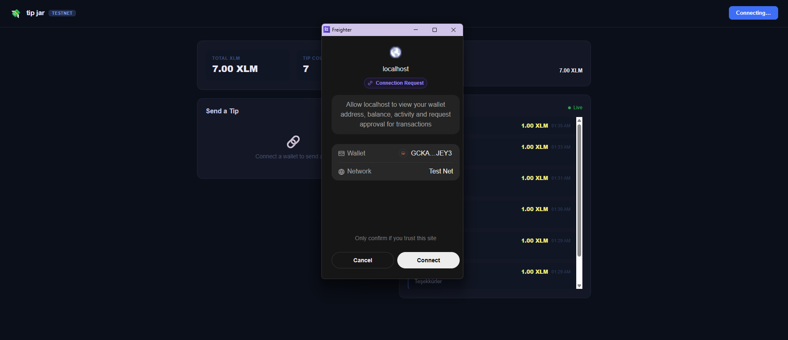
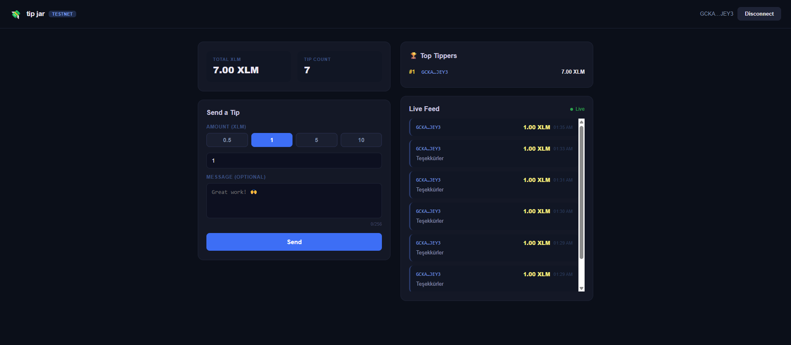
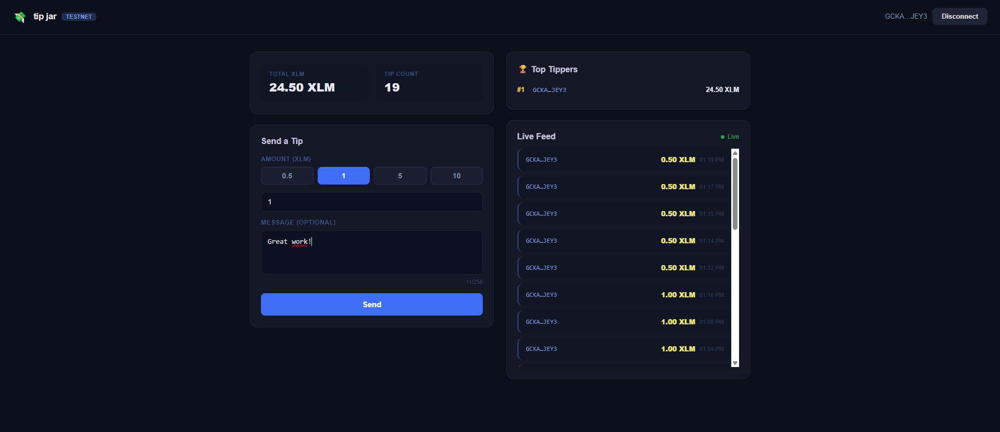
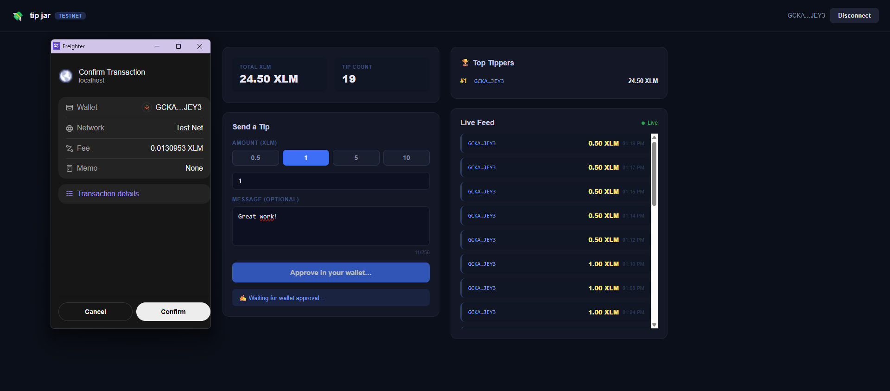
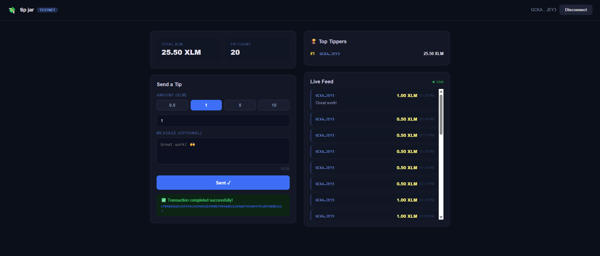

# 💸 Tip Jar — Stellar Soroban

Decentralized tip jar built on Stellar Soroban for the Yellow Belt submission.

## Screenshot








## Deployed Contract
| Network | Contract ID |
|---------|--------------|
| Testnet | `CC6ZGQ2662LAAIILMZ255KUBKLOD6LTKRQUB3IZQ4DRXCLCVVKKAAWKN` |

## Transaction Hash (sample contract call)
`cf048d3e81334754ce354e92b3950b7994ad8312648d7424a9479cd5fe0db211` — [View on Explorer](https://stellar.expert/explorer/testnet/tx/cf048d3e81334754ce354e92b3950b7994ad8312648d7424a9479cd5fe0db211)

---

## Setup

### Requirements
- Rust + `wasm32v1-none` target
- Stellar CLI
- Node.js 20+

### 1. Build and deploy the contract

```bash
cd contract

# Add the wasm target
rustup target add wasm32v1-none

# Build
stellar contract build

# Create and fund a testnet identity
stellar keys generate deployer --network testnet --fund

# Deploy
stellar contract deploy \
  --wasm target/wasm32v1-none/release/tip_jar.wasm \
  --source deployer \
  --network testnet
# → Copy the resulting Contract ID (CXXX...)

# Initialize (recipient address and native XLM SAC address)
stellar contract invoke \
  --id <CONTRACT_ID> \
  --source deployer \
  --network testnet \
  -- \
  initialize \
  --recipient <RECIPIENT_G_ADDRESS> \
  --native_token CDLZFC3SYJYDZT7K67VZ75HPJVIEUVNIXF47ZG2FB2RMQQVU2HHGCYSC
```

### 2. Run the frontend

```bash
cd frontend
npm install

# Create a .env.local file
echo "NEXT_PUBLIC_CONTRACT_ID=<CONTRACT_ID>" > .env.local

npm run dev
# → http://localhost:3000
```

### 3. Deploy to Vercel

```bash
npx vercel --prod
# Add the NEXT_PUBLIC_CONTRACT_ID environment variable in the Vercel dashboard
```

---

## Features

- **Multi-wallet**: Freighter, LOBSTR, xBull (via StellarWalletsKit)
- **3 error types handled**: Wallet not found · User rejected · Insufficient balance
- **TX status**: Pending → Success/Failed + Explorer link
- **Live feed**: Auto-refreshes every 8 seconds
- **Leaderboard**: Top 5 tippers

## Architecture

```
contract/          ← Soroban Rust contract
  src/lib.rs       ← send_tip, get_tips, TipSent event
frontend/
  src/
    lib/stellar.ts ← RPC, SDK config
    lib/contract.ts← Contract calls
    hooks/useWallet.ts ← StellarWalletsKit + error handling
    app/page.tsx   ← Main UI
```
